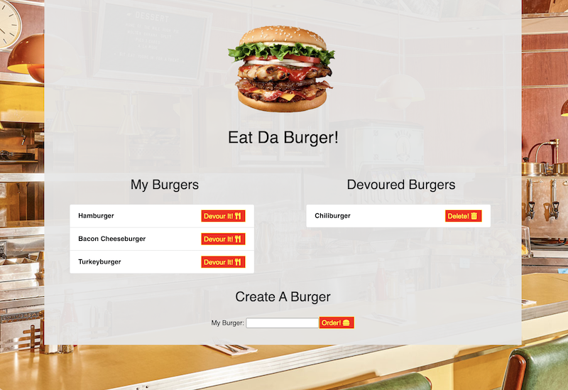

# Eat Da Burger!

## Introduction
This is the Eat Da Burger burger logger application. This application is created MySQL, Node, Express, Handlebars along with an ORM. Node and MySQL are used to query and route data within the application with Handlebars being used to generate HTML.
 

 
    Gif of app functionality

## Technologies Used
* HTML
* CSS
* JavaScript
* jQuery
* Node
* MySQL
* Express
* Handlebars
  
  

## Usage
Eat-Da-Burger! is a restaurant application for users to input the names of burgers they'd like to eat. Users can type in the name of a burger and place it into a list. From that list, users can keep track of which burgers have been eaten by placing them into a "Devoured" list. A video demonstration of the functionality of the application can be found [here](https://youtu.be/hfP5SDb8Dk0).

 

## Screenshots

 
    Screenshot of application webpage

 

## Contact Information
If you have questions about the application or contributions, I can be contacted via email at:
<maynperalta@gmail.com>
 
